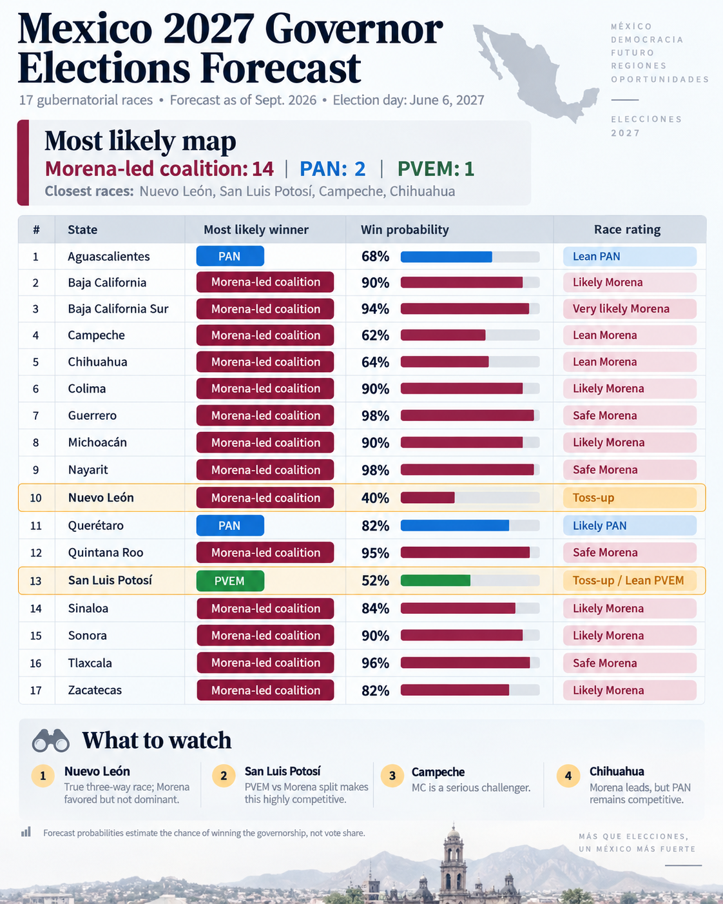

# Mexico 2027 Governor Elections Forecast

ChatGPT-5.6 (High) conversation on September 4, 2026.

## User prompt:

> For the 2027 midterm elections in Mexico, give me the probability of the winning party, the most likely outcome, for each of the 17 governor elections.

## Assistant:

As of **September 4, 2026**, I would treat the 2027 gubernatorial map as strongly favorable to the Morena-led bloc, but with four genuinely uncertain states: **Nuevo León, San Luis Potosí, Campeche, and Chihuahua**. The election is scheduled for **June 6, 2027**, with 17 governorships at stake.

My baseline is the September 3 Agenticus aggregation: **905 polls from 46 pollsters**, weighted by sample size, recency, pollster quality, historical error and house effects. Its current snapshot has Morena–PT–PVEM leading 14 states and PAN leading Aguascalientes and Querétaro; San Luis Potosí requires separate treatment because Morena, PVEM and PT have not agreed to run together there.

### Forecast

These are **probabilities of winning the governorship**, not projected vote percentages.

| State | Most likely winner | Win probability | Rating |
|---|---|---:|---|
| Aguascalientes | PAN | 68% | Lean PAN |
| Baja California | Morena-led coalition | 90% | Likely Morena |
| Baja California Sur | Morena-led coalition | 94% | Very likely Morena |
| Campeche | Morena-led coalition | 62% | Lean Morena |
| Chihuahua | Morena-led coalition | 64% | Lean Morena |
| Colima | Morena-led coalition | 90% | Likely Morena |
| Guerrero | Morena-led coalition | 98% | Safe Morena |
| Michoacán | Morena-led coalition | 90% | Likely Morena |
| Nayarit | Morena-led coalition | 98% | Safe Morena |
| Nuevo León | Morena-led coalition | 40% | Toss-up |
| Querétaro | PAN | 82% | Likely PAN |
| Quintana Roo | Morena-led coalition | 95% | Safe Morena |
| San Luis Potosí | PVEM | 52% | Toss-up / Lean PVEM |
| Sinaloa | Morena-led coalition | 84% | Likely Morena |
| Sonora | Morena-led coalition | 90% | Likely Morena |
| Tlaxcala | Morena-led coalition | 96% | Safe Morena |
| Zacatecas | Morena-led coalition | 82% | Likely Morena |

Here, “Morena-led coalition” means **Morena–PT–PVEM**, assuming the coalition agreement announced for 16 of the 17 gubernatorial races survives candidate selection.

### The four races to watch most closely

#### 1. Nuevo León — true toss-up

This is the state where the raw party polling is most misleading. The weighted party aggregate currently has Morena–PT–PVEM at about **31.9%, MC 21.1%, PAN 17.1% and PRI 15.2%**. A PAN–PRI coalition therefore starts almost level with Morena, while MC remains competitive.

More importantly, candidate effects are enormous: an August *El Universal* face-to-face poll gave Mariana Rodríguez **39% effective preference**, Clara Luz Flores 30% and Adrián de la Garza 29%; replacing Mariana with Luis Donaldo Colosio produced almost the same 39–29–29 configuration.

My current probabilities would therefore be approximately:

- **Morena coalition: 40%**
- **MC: 35%**
- **PAN/PRI: 25%**

That is much less certain than the nominal Morena party lead suggests.

#### 2. San Luis Potosí — PVEM versus Morena

This is the unique state where the national Morena–PVEM–PT agreement does not currently apply. Recent polling is genuinely contradictory. Some measurements put PVEM ahead, while others place Morena narrowly first as a party.

The reason I give the **PVEM a slight 52–42 advantage over Morena** is the candidate effect of **Ruth González**, who has polled substantially stronger than the Verde's underlying party identification.

This forecast could change dramatically if the 4T parties ultimately negotiate a unified candidacy.

#### 3. Campeche — Morena vs MC

The aggregate gives Morena–PT–PVEM a lead, but individual recent polls show substantially more competition. MC is therefore a serious challenger.

I would not give Morena the very high win probability suggested by a mechanical conversion of the aggregate lead. **About 62% Morena / 35% MC / 3% others** seems more defensible this far from election day.

#### 4. Chihuahua — Morena favored, but not safe

The weighted aggregate gives Morena–PT–PVEM a meaningful lead, but a PAN–PRI alliance remains potentially competitive, and candidate selection inside Morena could matter.

Hence I would put Morena at about **64%**, rather than treating Chihuahua as already decided.

### Two interesting cases that look safer

**Querétaro** currently looks quite good for the PAN. The weighted average gives PAN a substantial advantage over Morena–PT–PVEM. I therefore put PAN at roughly **82%**.

**Aguascalientes**, in contrast, is noticeably less secure. PAN still leads, but the trend has recently moved toward Morena. That pushes my forecast down to about **68% PAN**.

### The state I would downgrade despite a large Morena lead

That is **Sinaloa**. Morena–PT–PVEM still leads comfortably, but the recent trajectory has been unusually unfavorable. That is why I assign about **84% rather than 95–98%**.

### Modal outcome

Taking the single most probable winner in every state:

- **Morena-led coalition: 14 governorships**
- **PAN: 2**
- **PVEM: 1**
- **MC: 0**

In other words, the modal map has PAN retaining **Aguascalientes and Querétaro**, Morena taking **Chihuahua and Nuevo León** from the opposition, and PVEM retaining **San Luis Potosí**.

This should **not** be interpreted as meaning Morena will definitely win 14 states. Once uncertainty is incorporated, the expected number of governorships won by the broader Morena/PVEM/PT camp is closer to roughly **13 of 17**.

### Sources referenced:

- Agenticus — Mexico 2027 polling aggregation: https://agenticus.mx/
- El Economista — coalition negotiations for 2027: https://www.eleconomista.com.mx/
- El Universal — Nuevo León gubernatorial polling: https://www.eluniversal.com.mx/
- SRC — state-level polling: https://www.src.org.mx/
- CE Research — state-level polling: https://ceonline.com.mx/
- Alius Polls — Chihuahua polling: https://aliuspolls.com/

---

## User prompt:

> Create an infographic with the forecast.

## Assistant:

Generated the following infographic:

---
